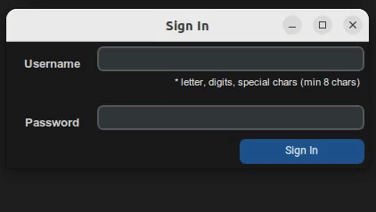
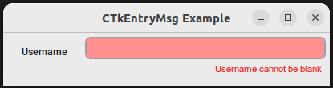

# CTkEntryMsg


### CTkEntry widget with messages

CTkEntry widget with provision to add 
short information, warning, and error messages below the widget.

<p align="center">
  <picture>
    <source media="(prefers-color-scheme: dark)" srcset="./doc_images/ctkentrymsg_demo.gif">
    
  </picture>
</p>

**Table of Contents**
- [Features](#features "Features")
- [Installation](#installation "Installation")
- [Usage](#usage "Usage")
- [Basic Example](#basic-example "Basic Example")
- [Arguments](#arguments "Arguments")
- [Methods](#methods "Methods")
- [More Examples](#more-examples "More Examples")
- [License](#license "License")

## Features
- Set default messages
- Show information, warning, errors
- Set timeout for errors and warnings
- Chain multiple messages

## Installation
```pip3 install ctkentrymsg```

## Usage
```
entry = CTkEntryMsg(root,...)
```

## Basic Example
```
from ctkentrymsg import CTkEntryMsg
from customtkinter import CTk, CTkLabel

root = CTk()

root.title('CTkEntryMsg Example')

CTkLabel(root, text='Username', width=100).grid(
    row=0, column=0, sticky='nw', padx=(2,0), pady=(10,0))

username = CTkEntryMsg(
    root, 
    default_msg='* letter,digits, special chars (min 8 chars)',
    msg_default_color='blue',
    highlight=True,
    width=300)
username.grid(row=0, column=1, sticky='ne', pady=(5,0), padx=(0,5))
# showing an error
username.showerror(msg='Username cannot be blank')

root.mainloop()
```
**Output:**

<p align="center">
  <picture>
    <source media="(prefers-color-scheme: dark)" srcset="./doc_images/basic_usage.png">
    
  </picture>
</p>

## Arguments
| Argument | Description |
| ------ | ------ |
| master | root, tkinter.Frame or CTkFrame |
| default_msg | optional default message to show under Entry widget |
| msg_default_color | default message text color. Defaults to #000000 |
| msg_warn_color | message text color for warnings. Defaults to #FC8309 |
| msg_error_color | message text color for errors. Defaults to #FC0909 |
| msg_font: tuple | message font. Defaults to ('Arial', 12)|
| highlight | change entry widget's foreground color on warning or error. Default is True |
| highlight_warn_color | foreground color for entry on warning. Defaults to #FAC36A |
| highlight_error_color | foreground color for entry on error. Defaults to #FF9090 |
| msg_timeout | global message timeout (in milliseconds) for warnings and errors. Defaults to 3000 ms |

## Methods
| Method | Description |
| ------ | ------ |
| .restore_msg() | Restores message to default state |
| .restore_entry() | Restores entry widget to default state |
| .showerror(msg,...) | Displays error |
| .showwarn(msg,...) | Displays warning |
| .msg_queue(messages) | Chains multiple messages |

<br/>

**Inherited methods from CTkEntry widget**
| Method | Description |
| ------ | ------ |
| .configure(*args, **kwargs) | Configure CTkEntry widget's attribute. Ex: entry.configure(fg_color="#000000")
| .cget(attribute_name) | Returns value for attribute (passed as string) Ex: state = entry.cget("state") |
| .bind(*args, **kwargs) | Bind command function to event specified by sequence |
| .delete(first_index, last_index=None) | Deletes characters from the widget, starting with the one at index first_index, up to but not including the character at position last_index. If the second argument is omitted, only the single character at position first is deleted. |
| .insert(index, string) | Inserts string before the character at the given index |
| .get() | Returns current string in the entry. |
| .focus() | Set the focus on the CTkEntry widget |
| .focus_force() | Focuses a widget and the window it's in, immediately |
| .index(index) | Shift the contents of the entry so that the character at the given index is the leftmost visible character. Has no effect if the text fits entirely within the entry. |
| .icursor(index) | Set the insertion cursor just before the character at the given index. |
| .select_adjust(index) | This method is used to make sure that the selection includes the character at the specified index. If the selection already includes that character, nothing happens. If not, the selection is expanded from its current position (if any) to include position index. |
| .select_from(index) | Sets the tk.ANCHOR index position to the character selected by index, and selects that character. |
| .select_clear() | Clears the selection. If there isn't currently a selection, has no effect. |
| .select_present() | If there is a selection, returns true, else returns false. |
| .select_range(start_index, end_index) | Sets the selection under program control. Selects the text starting at the start index, up to but not including the character at the end index. The start position must be before the end position. |
| .select_to(index) | Selects all the text from the tk.ANCHOR position up to but not including the character at the given index.  |
| .xview(index) | Same as .xview(). This method is useful in linking the Entry widget to a horizontal scrollbar. |
| .xview_moveto(f) | Positions the text in the entry so that the character at position f, relative to the entire text, is positioned at the left edge of the window. The f argument must be in the range [0,1], where 0 means the left end of the text and 1 the right end. |
| .xview_scroll(number, what) | Used to scroll the entry horizontally. The what argument must be either tk.UNITS, to scroll by character widths, or tk.PAGES, to scroll by chunks the size of the entry widget. The number is positive to scroll left to right, negative to scroll right to left. For example, for an entry widget e, e.xview_scroll(-1, tk.PAGES) would move the text one “page” to the right, and e.xview_scroll(4, tk.UNITS) would move the text four characters to the left. |

# More Examples

## Chaining Messages
Queues the messages and shows them one after another, seperated at an interval specified in
```timeout``` or ```msg_timeout``` argument.
```
entry = CTkEntryMsg(root, width=300)
messages = [
    ('error', 'An error message', 1000),
    ('warn', 'A warning message', 1000),
    ('error', 'Another error')
]
entry.msg_queue(messages)
```
## Persistent messages
Keeps the message and the entry widget highlighted even after timeout.
```
entry = CTkEntryMsg(root, width=300)
entry.showwarn(
  msg='This is a warning', 
  persist_msg: bool = True, 
  persist_highlight: bool = True)
```
## Setting Message Timeout
Set a default timeout or message specific timeout
```
# timeout for all messages
entry = CTkEntryMsg(root, ..., msg_timeout=2000)
# this error is shown for 2 seconds
entry.showwarn('This is an error')
# this error is shown only for 1 second
entry.showerror('This is an error', timeout=1000)
```
## Setting Attributes
```
entry = CTkEntryMsg(
    root, 
    fg_color='black',
    text_color='white',
    width=300)
```
You can also use .configure(...)
```
entry.configure(font=('Arial', 12), width=400,...)
```
## License
[MIT]()

